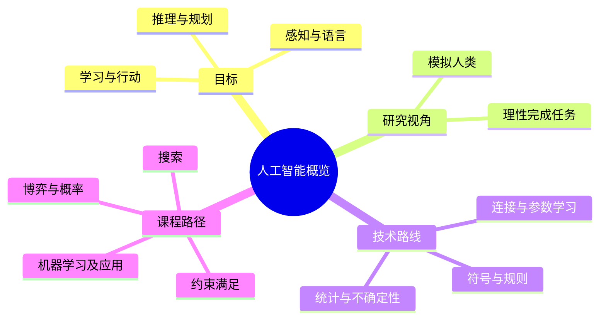

# CS181 第 1 周周一：人工智能概览

本节先说明课程安排，再建立人工智能的研究范围、历史脉络及三条主要技术路线。图片为录屏中人工筛选的代表性完整页，并非原始 PPT 文件；时间可用于回看视频。

## 逐页注释

1. [课程封面，约 03:28](page_003.jpg)：CS181 人工智能；后续内容同时覆盖从计算过程出发的搜索和从数据出发的学习。
2. [课程安排，约 07:20](page_005.jpg)：介绍助教、办公时间和联系渠道；具体信息以课程平台公告为准。
3. [先修要求，约 08:08](page_006.jpg)：编程语言、数据结构、概率统计、线性代数与微积分是理解算法及后续概率模型的基础。
4. [考核，约 11:44](page_009.jpg)：课程由编程作业、项目和考试等组成；截止日期和比例须核对最新公告。
5. [AI 是什么，约 23:52](page_016.jpg)：智能任务既包括感知和语言，也包括规划、推理和行动。不能用单一应用等同整个 AI。
6. [人工智能的定义，约 31:28](page_018.jpg)：课件强调构造能表现出智能行为的机器和软件；“像人”与“理性地完成目标”是不同的评价视角。
7. [人脑与智能，约 39:04](page_020.jpg)：人脑可以启发 AI，但 AI 不必逐步复制人脑；老师用鸟翼与飞行器的类比说明这一点。
8. [课程主题，约 43:28](page_022.jpg)：搜索、约束满足、博弈、概率推理、机器学习和 NLP 等构成课程地图。
9. [AI 的基础学科，约 44:56](page_023.jpg)：哲学、数学、经济学、神经科学、心理学、计算机工程、控制论和语言学共同影响 AI。
10. [图灵与早期历史，约 49:52](page_024.jpg)：图灵测试关注自然语言交互中机器是否可被区分，不是判断所有形式智能的充分条件。
11. [符号主义与连接主义，约 52:00](page_026.jpg)：前者用符号和规则表达知识并推理，后者让大量简单单元通过连接和学习形成行为。
12. [AI 子领域，约 74:40](page_029.jpg)：知识表示与推理、机器学习、机器人、自然语言处理和视觉各解决不同环节的问题。
13. [弱 AI 与强 AI，约 87:28](page_036.jpg)：单任务系统与能跨情境规划、推理和调用工具的系统不是同一能力层级；课堂把它作为能力范围的讨论，而非已有严谨测试。
14. [三条技术路线，约 90:16](page_041.jpg)：符号、连接和统计方法分别强调规则、可学习参数及不确定性建模，实际系统可组合使用。
15. [符号主义，约 90:40](page_042.jpg)：先设计概念和逻辑规则，再对事实作演绎；优点是结构清楚，难点是知识获取与复杂场景的覆盖。
16. [连接主义，约 94:16](page_045.jpg)：神经网络从数据调整权重；训练时优化参数，推理时使用已学权重计算输出。
17. [统计方法，约 95:36](page_047.jpg)：用概率分布表示不确定性，观察证据后更新判断；不要把概率预测当成确定性结论。
18. [搜索问题，约 98:32](page_050.jpg)：课程接下来以状态、动作和目标定义问题，并讨论如何在状态空间中找路径。
19. [约束满足例子，约 99:52](page_053.jpg)：地图着色要求相邻区域颜色不同；它是寻找满足所有限制的赋值，不一定需要路径代价。

## 整节笔记

AI 不是某一个模型，而是构建能够感知、推理、规划、学习和行动的系统。目标可从“模拟人的行为”或“合理地实现任务”两种角度界定，二者并不等价。研究方法也不是互斥阵营：符号方法善于显式知识与规则推理，连接方法从数据中优化参数，统计方法表达和处理不确定性。

本课程的第一大块将把任务形式化为搜索或约束满足问题。搜索通常要定义初始状态、可选动作、状态转移、目标测试和路径代价；约束满足问题则以变量、取值域和约束描述合法解。先分清问题表示，再选算法。

## 思维导图

