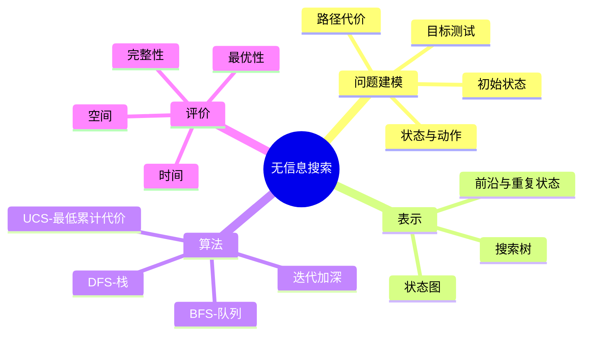

# CS181 第 1 周周三：状态空间与无信息搜索

本节从反射型/规划型智能体出发，定义搜索问题及状态空间，随后比较 DFS、BFS、迭代加深和统一代价搜索。所选页面为录屏中的完整课件状态。

## 逐页注释

1. [反射型智能体，约 10:24](page_006.jpg)：反射型智能体根据当前感知作局部决策，面对需要多步规划的问题可能不足。
2. [规划型智能体，约 16:48](page_010.jpg)：规划先推演动作后果，再选择能到达目标的动作序列。
3. [搜索问题组成，约 22:16](page_013.jpg)：状态空间、后继函数、初始状态和目标测试决定了问题；路径代价进一步定义“更好”的解。
4. [罗马尼亚地图，约 25:04](page_016.jpg)：城市是状态，道路是动作，地图提供后继关系；寻找布加勒斯特的路线是直观例子。
5. [状态空间，约 28:32](page_018.jpg)：现实世界状态往往很大，建模时保留与目标和动作相关的信息，忽略不必要细节。
6. [状态空间规模，约 35:28](page_020.jpg)：分支因子和解深度使可达节点数迅速增长，是搜索算法需要控制时间与内存的原因。
7. [状态图与搜索树，约 41:36](page_022.jpg)：状态图中的同一状态可能由不同路径到达；搜索树展开后会出现重复节点。两者不能混为一谈。
8. [树搜索，约 44:48](page_024.jpg)：前沿（frontier）保存待展开节点；策略决定下一步取哪个节点。
9. [一般树搜索框架，约 63:28](page_029.jpg)：反复从前沿取节点、检查目标并展开后继；不同算法主要改变前沿的取出顺序。
10. [DFS，约 67:36](page_031.jpg)：深度优先优先深入一条分支，常用栈；内存低，但可能钻入无穷分支，且通常不保证最优。
11. [DFS 性质，约 73:20](page_034.jpg)：完整性和复杂度要结合状态空间是否有限、是否做环检测来判断，不能只记“快/慢”。
12. [BFS，约 79:52](page_037.jpg)：广度优先逐层展开，常用队列；若每步代价相同，首次找到的目标是最浅解。
13. [BFS 性质，约 81:12](page_040.jpg)：BFS 可在有限分支因子下找到最浅目标，但保留整层节点带来指数级空间压力。
14. [DFS 与 BFS，约 84:00](page_043.jpg)：比较时需分别看完整性、最优性、时间和空间，不存在对所有问题都更好的单一算法。
15. [迭代加深，约 84:40](page_044.jpg)：以逐步增加的深度限制重复 DFS，结合 BFS 的浅层解保证与 DFS 的较低内存占用。
16. [带代价的搜索，约 87:12](page_045.jpg)：动作成本不相同后，最少步数不等于最低成本；BFS 的最优性条件失效。
17. [统一代价搜索，约 88:08](page_046.jpg)：按累计路径代价 $g(n)$ 最小优先展开，常用优先队列。
18. [UCS 性质，约 93:04](page_048.jpg)：在合适的正代价下，UCS 完整且能找到最低成本解；仍可能占用大量内存。
19. [共同的前沿结构，约 99:28](page_055.jpg)：DFS、BFS、UCS 可以看成同一个搜索框架配不同的前沿排序方式。

## 整节笔记

形式化搜索问题的关键是状态表示。状态应足以预测动作结果和判断是否达到目标；搜索树的“节点”还需记录到达该状态的路径，因此状态图和搜索树不是同一种对象。为避免重复探索，要考虑已访问集合或最佳到达代价。

无信息搜索不利用估计剩余距离的启发式。DFS 按深度走，BFS 按层走，UCS 按已付成本走；迭代加深通过多轮深度限制缓解 BFS 的内存问题。选择算法时首先确认目标是“最少动作”还是“最低总代价”，再审视完整性和复杂度的适用条件。

## 思维导图

