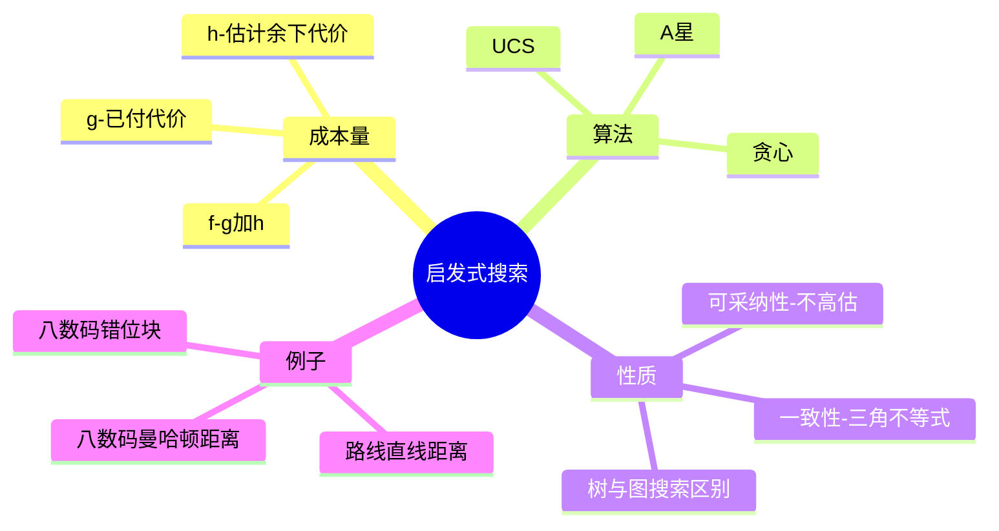

# CS181 第 2 周周一：启发式搜索与 A*

本节从 UCS 的代价排序出发，引入估计剩余代价的启发函数，比较贪心搜索和 A*；后半节讨论可采纳性、一致性与八数码启发式。页面为录屏截图，课堂演示中的临时窗口未纳入最终页集。

## 逐页注释

1. [UCS 回顾，约 16:24](page_008.jpg)：UCS 只依据已经付出的路径成本 $g(n)$ 排序，对“离目标还多远”没有估计。
2. [煎饼问题，约 18:58](page_011.jpg)：用动作序列与成本示例说明，任务不同就要重新定义状态、合法动作和目标。
3. [启发式搜索，约 23:52](page_014.jpg)：启发式 $h(n)$ 估计从当前节点到目标的剩余成本，可引导搜索方向。
4. [搜索启发函数，约 24:48](page_015.jpg)：同一问题可设计不同启发式；质量取决于能否快速计算且对真实余下成本有信息量。
5. [罗马尼亚地图启发式，约 28:08](page_017.jpg)：到目标城市的直线距离可作道路距离的下界，是地理路线规划的直观估计。
6. [贪心搜索，约 29:44](page_018.jpg)：只按 $h(n)$ 最小扩展，看似迅速靠近目标，却可能忽略已经付出的高成本。
7. [贪心搜索的局限，约 33:12](page_021.jpg)：局部“看起来最近”不保证总路径成本最低；遇到障碍或误导性启发式可能走弯路。
8. [A*，约 35:36](page_024.jpg)：排序函数 $f(n)=g(n)+h(n)$ 同时考虑已付成本和估计余下成本。
9. [UCS 与贪心的结合，约 36:08](page_025.jpg)：$h=0$ 时 A* 退化为 UCS；只看 $h$ 则是贪心。A* 的价值在于兼顾两端。
10. [A* 何时终止，约 41:04](page_028.jpg)：不能只因“生成”目标节点就停止；在满足条件的 A* 中，应在目标从前沿被取出时判定解。
11. [可采纳启发式，约 51:20](page_032.jpg)：$h(n)\leq h^*(n)$，即永不高估真实最小剩余成本，构成树搜索最优性的关键条件。
12. [树搜索最优性，约 66:08](page_038.jpg)：证明比较最优路径上的前沿节点和较差目标的 $f$ 值；先取出的不可能是更差目标。
13. [图搜索与重复状态，约 73:20](page_042.jpg)：状态图中可能从多条路径到达同一状态；处理关闭节点和更优路径需要额外条件。
14. [八数码问题，约 82:32](page_050.jpg)：拼图状态由格子排列决定，动作是把空格与相邻块交换；可设计忽略部分限制的启发式。
15. [错位块数，约 86:08](page_051.jpg)：数不在目标位置的数字块；它低估或等于实际移动次数，计算便宜但信息较粗。
16. [曼哈顿距离，约 87:52](page_054.jpg)：各数字块到目标位置的行列距离之和，通常比错位块数提供更强的下界。
17. [图搜索的陷阱，约 96:16](page_059.jpg)：若启发式不一致，已关闭状态可能需要重新打开；不能机械套用树搜索结论。
18. [一致性，约 99:28](page_061.jpg)：对任意边 $(n,n')$，$h(n)\leq c(n,n')+h(n')$；它使路径上的 $f$ 不下降。
19. [A* 总结，约 103:12](page_065.jpg)：A* 使用前后成本总估计，启发式越有信息量通常扩展越少，但内存仍可能成为瓶颈。

## 整节笔记

启发函数不是神谕，而是可计算的下界或估计。UCS 的优先级为 $g$，贪心为 $h$，A* 为 $g+h$。可采纳性指不高估最优剩余代价；一致性是沿边满足三角不等式，更便于图搜索的最优性保证。设计八数码启发式时，可从“放宽原问题限制”获得安全下界。

容易混淆的三个时间点是：生成目标、目标进入前沿、目标从前沿被取出。A* 的终止判据一般是最后一种。另一陷阱是把树搜索的证明直接搬到图搜索；后者还要考虑重复状态与重新打开节点。

## 思维导图

