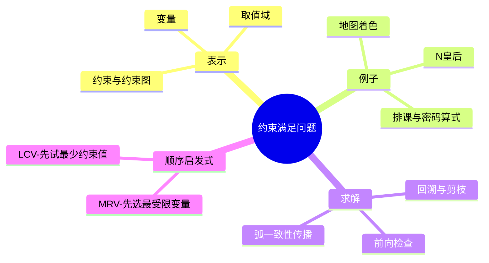

# CS181 第 2 周周三：约束满足问题与回溯搜索

本节先结束 A*，再将问题表示改为变量、取值域和约束的约束满足问题（CSP），介绍回溯、前向检查、约束传播以及变量/取值顺序启发式。所选图片是课件内容页，演示动画中间态已合并。

## 逐页注释

1. [A* 回顾，约 09:12](page_006.jpg)：可采纳性限制估计值不超过真实剩余成本；对图搜索还需关注重复状态。
2. [A* 图搜索，约 11:20](page_008.jpg)：回顾错误关闭节点可能导致失去更优路径的情形；需明确实现是否允许重新打开。
3. [一致性，约 12:24](page_009.jpg)：一致启发式满足沿边三角不等式，使 $f$ 值沿路径不下降。
4. [什么是搜索，约 15:38](page_013.jpg)：从路径搜索转向寻找满足条件的状态/赋值，目标表示方式发生变化。
5. [CSP 例子，约 18:08](page_016.jpg)：地图着色、数独、排课、N 皇后都可写成约束满足问题。
6. [CSP 表示，约 19:20](page_017.jpg)：形式化为变量集合 $X$、每个变量的域 $D$、约束集合 $C$；解是满足全部约束的完整赋值。
7. [地图着色，约 22:32](page_018.jpg)：每个区域是变量、颜色是取值域，邻接区域不得同色是二元约束。
8. [N 皇后，约 25:04](page_020.jpg)：可用每列皇后所在的行作变量取值；约束禁止同一行或对角线冲突。不同表示的搜索规模不同。
9. [约束图，约 33:28](page_026.jpg)：节点代表变量，边代表二元约束；图结构可用于传播与分解问题。
10. [密码算式，约 35:28](page_027.jpg)：字母对应数字且相互不同，进位也可当变量；说明约束不限于简单的“不等”。
11. [CSP 类型，约 41:44](page_029.jpg)：变量和域可离散或连续，约束可一元、二元或更高元；本节主要看离散有限域。
12. [真实应用，约 46:48](page_032.jpg)：排班、资源调度等问题的主要挑战是组合空间和约束间的相互作用。
13. [回溯搜索，约 64:56](page_038.jpg)：逐变量赋值，一旦部分赋值违反约束就撤回并尝试其他值，避免生成完整无效赋值。
14. [回溯树，约 66:24](page_041.jpg)：深度对应已赋值变量数量，剪枝发生在发现约束冲突时。
15. [改进回溯，约 70:16](page_046.jpg)：改进方向包括变量顺序、取值顺序和对未赋值变量的提前约束检查。
16. [前向检查，约 73:36](page_048.jpg)：赋值后删去相邻未赋值变量中不兼容的候选值；若某个域变空即可立即回溯。
17. [约束传播，约 77:52](page_055.jpg)：反复利用约束缩小取值域，比只检查直接邻居更强，但也有计算成本。
18. [单条弧一致性，约 80:08](page_057.jpg)：弧 $X\to Y$ 一致意味着 $X$ 的每个剩余值在 $Y$ 的域中至少有一个支持值。
19. [整体弧一致性，约 83:36](page_060.jpg)：把受影响的弧反复放回队列，直到不再删值或发现空域；局部一致不保证全局有解。
20. [最少剩余值，约 96:08](page_070.jpg)：优先选择域最小的变量（MRV），尽早暴露失败。
21. [最少约束值，约 97:36](page_072.jpg)：在选定变量后优先尝试排除其他变量候选最少的值（LCV），保留后续灵活性。

## 整节笔记

CSP 与路径搜索的主要区别是目标为满足约束的赋值，而不是一条动作路径。变量、域和约束的设计直接决定求解难度。回溯是一种深度优先构造解的方法；只要当前部分赋值已冲突，就不必继续往下走。

前向检查在赋值后处理直接邻居；弧一致性进一步反复传播约束。它们通过额外计算减少分支，但“弧一致”并不表示必定存在完整解。MRV 决定先选哪个变量，LCV 决定先试哪个值，方向相反却互补：先暴露最受限位置，同时少破坏未来选择。

## 思维导图

