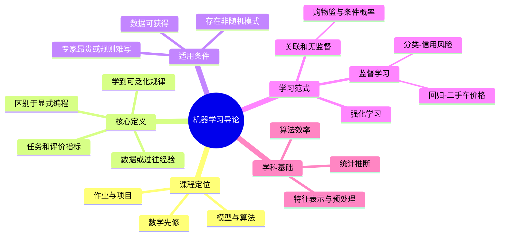

# CS182 第 1 周周二：课程概览与机器学习导论

课堂录屏：2026-09-15，赵子平。下方页面取自屏幕录播；页码是本地抽取序号，不等于原 PPT 页码。语音转写有错字，术语以画面为准。开课前的登录页、误开的其他课程 PPT、课末桌面和重复展示状态未收入。

## 本节主线

这节课先交代课程目标与考核，再从“什么是机器学习、什么时候需要它”进入学习范式。核心不是把算法名背下来，而是理解：给定任务和评价标准，模型从经验数据中提取可泛化的规律；这与按固定规则显式编程不同。后半段用购物篮分析、信用风险分类和二手车价格预测区分无监督的关联、监督分类与回归。

## 逐页注释

### 课程安排

1. [课程封面，04:56](page_004.jpg)：CS182 是 Introduction to Machine Learning。老师说明本班相对偏模型、算法和推导，不是只演示应用工具。
2. [CS182 不是什么，16:00](page_008.jpg)：它不是面向大众的泛泛科普、轻松的入门课，也不是给每个领域“套模型”的工具手册；学习时要准备分析模型和数学原理。
3. [CS182 是什么，18:08](page_009.jpg)：课件明确强调概念和技术的工作量，适合对机器学习理论或应用有较强兴趣的学生。
4. [课程信息，18:32](page_010.jpg)：核对教师、上课地点、网站和 Piazza 等课程入口。具体联系方式与作业要求以课件及教学平台最新公告为准。
5. [课程描述，19:44](page_011.jpg)：机器学习通过数据使计算机系统改进表现；课堂会介绍常见模型及其计算、原理，而不把应用效果与模型机制混为一谈。
6. [主要主题，24:40](page_012.jpg)：路线包括贝叶斯决策、生成模型的参数估计、线性判别、多层感知机、SVM、降维、非参数方法、集成学习和模型选择。老师特别解释“判别”常对应分类，多层感知机是神经网络的基础。
7. [先修背景，36:00](page_013.jpg)：需用到多元微积分、线性代数与矩阵分析、概率统计、优化、信息论，以及基本编程和数据结构。这里是后续公式推导的准备清单。
8. [参考资料，38:24](page_014.jpg)：主要参考 Murphy 的 *Introduction to Machine Learning*，课件还列出 Duda 等人的 *Pattern Classification* 和 Bishop 的 *Pattern Recognition and Machine Learning*。参考书用于补推导和不同表述，不替代课堂要求。
9. [考核，38:56](page_015.jpg)：页面列出编程作业、期末考试和期末项目的权重及节点；精确截止日期请以平台公告核对，勿只靠语音转写记忆。
10. [学术诚信，41:12](page_016.jpg)：作业和项目必须遵守学校诚信规范，尤其注意代码、报告与合作边界。

### 机器学习的基本问题

11. [导论封面，41:52](page_018.jpg)：从行政信息转入“什么是机器学习”和学习范式。
12. [导论目录，42:16](page_019.jpg)：本章依次讨论定义、学习范式、多项式拟合示例，再进入监督学习、分类、回归和模型选择；本次录播主要讲到回归。
13. [什么是机器学习，43:52](page_020.jpg)：在指定任务/评价标准下，系统从数据或过往经验中改进表现，而不是让人对每一种输入写死规则。Data Mining、KDD、Data Science 与之相关，但关注的对象和应用语境不完全相同。
14. [何时需要机器学习，49:20](page_021.jpg)：适用于人工专家昂贵、没有明确专家规则、专家能做却难以解释步骤，或环境会变化的任务。网络入侵检测、病理图像、火星车导航和语音识别是课堂例子。
15. [学习条件，69:04](page_024.jpg)：数据应可获得、问题存在可学习的模式，且过程不能完全随机。学习是从观测反推规律的逆问题；即使“小样本学习”也需要足够信息或先验，不意味着可以从零信息可靠推断。
16. [统计与计算机科学，77:04](page_025.jpg)：统计提供从样本推断的工具；计算机科学关注学习算法的效率、预测精度以及时间和空间复杂度。两者共同支撑机器学习。

### 学习范式与例子

17. [学习范式，82:56](page_026.jpg)：课件先区分关联学习、监督学习（分类、回归）、无监督学习和强化学习。分类依据是训练信息及任务目标，不是算法名字听起来是否“智能”。
18. [关联规则，84:00](page_027.jpg)：购物篮分析考察项目共同出现的条件概率，例如买啤酒的顾客还买某商品的比例。相关性可用于陈列和推荐，但老师讲的“啤酒与尿布”故事只是说明关联，不能单凭共现推出因果。
19. [监督学习，89:20](page_028.jpg)：已知输入及对应输出，从例子学到映射后预测新样本。所得模型还可用于解释关系、压缩经验，或识别偏离通常规律的异常点。
20. [分类：信用风险，92:08](page_029.jpg)：用收入与储蓄作为两个数值特征，将客户映射到二维特征空间，学习一条区分高、低风险的决策边界。特征要量化，预处理与模型训练是不同步骤。
21. [分类应用，103:04](page_030.jpg)：人脸、字符、语音、目标识别，诊断、欺诈检测、垃圾邮件过滤等都可构成分类问题。要先定义类别与评价指标，不能仅凭应用名称确定方法。
22. [回归：二手车价格，104:24](page_031.jpg)：价格是连续值，模型根据车辆属性预测价格；与分类输出离散类别不同。课件用 $y=g(x\mid\theta)$ 表示由参数决定的预测函数。

## 复习笔记

- **机器学习的四个要素**：任务、经验数据、表现指标和从数据学到的模型。判断一个问题是否适合机器学习，先问“什么可观测、什么要预测、怎样衡量好坏”。
- **显式编程与学习**：排序等规则明确的任务可以直接写算法；对于语音、图像或复杂环境中的模式，规则难以穷举，才需要从样本归纳。
- **可学习性前提**：数据要覆盖目标情形，信号不能淹没在随机性中；训练集上的规律还要能用于未来案例。课堂所说数据“便宜且丰富”是常见适用条件，不是所有任务的必要定理。
- **监督学习**：训练例子有目标输出。分类输出类别，如信用风险；回归输出连续数值，如车价。输入可以表示为特征向量，训练过程学习由参数决定的映射或决策边界。
- **无监督/关联**：没有预先给定的类别标签，也能寻找样本之间的结构或共现规律。条件概率 $P(Y\mid X)$ 描述观察到 $X$ 时 $Y$ 的比例，不自动证明 $X$ 导致 $Y$。
- **课程学习策略**：补齐概率、线代与优化基础；对每个模型同时追问假设、目标函数、参数如何求、泛化与局限，而非只记算法名字。

## 思维导图

## 核对提示

这份笔记根据屏幕 PPT 和中文转写整理，不是原始课件文件。录屏 10:10 前有网页和其他课程窗口；课件中的行政信息可能随学期调整。转写中“机器学习”“线性判别”等词偶有识别错误，这里按课件和上下文统一了术语。
