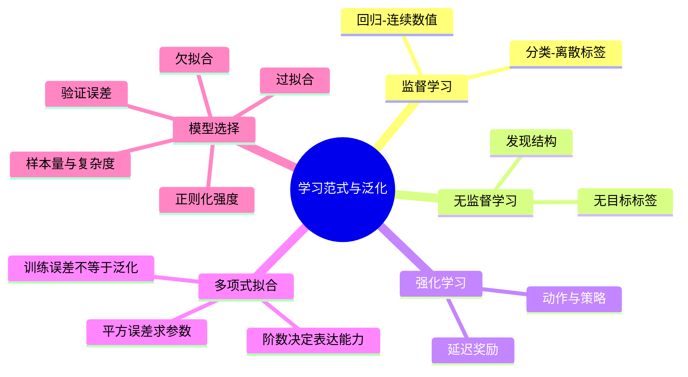

# CS182 第 1 周周四：学习范式与多项式拟合

课堂录屏：2026-09-17。图片来自屏幕视频；抽取序号不是原课件页码。同一页反复回看的截图只保留一次，以下时间指第一次讲到该画面的附近。

## 本节主线

先补全监督学习中的回归、无监督学习和强化学习，再用带噪声的多项式曲线拟合解释机器学习最重要的几组关系：模型复杂度与样本量、训练误差与测试误差、过拟合与正则化。最后开始形式化二分类训练集。

## 逐页注释

1. [导论目录，07:12](page_003.jpg)：延续上节的学习范式，随后进入多项式曲线拟合及分类问题。
2. [分类例子，07:52](page_004.jpg)：信用评分以收入、储蓄等特征学习类别边界；类别标签是离散的。
3. [分类的其他应用，18:40](page_005.jpg)：人脸、字符、语音、目标、欺诈等任务都可用分类框架描述；应用名称本身不决定具体模型。
4. [回归例子，18:56](page_006.jpg)：二手车价格是连续输出，可把输入属性 $x$ 映射到预测价格 $y=g(x\mid\theta)$。
5. [回归的其他应用，31:04](page_009.jpg)：转向角、机器人关节角度等可视为连续数值预测；像评分这类有限档位的输出，按问题定义既可能被处理成分类，也可能近似成回归。
6. [无监督学习，32:32](page_010.jpg)：没有每个样本对应的目标标签，仍可从特征中发现密度、聚类、低维表示或异常。它不是“完全没有数据”。
7. [强化学习，45:12](page_013.jpg)：智能体通过行动和反馈试错，学习行动策略；奖励或惩罚可能延迟出现，因此不同于每个样本都有正确答案的监督学习。
8. [曲线拟合的任务，61:36](page_014.jpg)：观测到带噪声的输入输出样本，目标是预测新输入的输出，而非精确复原每个训练点。课件以近似正弦函数的数据作例子。
9. [多项式模型，66:16](page_015.jpg)：使用 $h(x,w)=\sum_{j=0}^{M}w_jx^j$；阶数 $M$ 决定函数族的表达能力。它对 $x$ 非线性，但对参数 $w$ 是线性的。
10. [误差最小化，68:40](page_016.jpg)：用预测值与观测值的平方差构造误差函数，寻找使训练误差最小的参数。低训练误差只是拟合已见样本，不等同于泛化好。
11. [多项式阶数，78:48](page_021.jpg)：低阶模型可能无法表达真实趋势；九阶模型甚至能穿过几乎所有训练点，却可能是在拟合噪声。
12. [过拟合，81:52](page_022.jpg)：随阶数升高，训练误差持续下降，但测试误差可能先降后升。应在未参与拟合的数据上比较模型，而不是按训练误差选最高阶。
13. [拟合系数，85:44](page_027.jpg)：高阶插值为追随少量点，可能产生绝对值很大的系数和剧烈摆动；这提示需要限制模型的有效复杂度。
14. [正则化，87:44](page_028.jpg)：在平方误差后增加参数惩罚项，如 $\lambda\lVert w\rVert_2^2$，抑制过大的系数。$\lambda$ 控制拟合数据与限制复杂度的权衡。
15. [正则化不足，92:24](page_029.jpg)：惩罚太弱时，高阶模型仍会追随噪声，测试表现差。
16. [正则化过强，92:40](page_030.jpg)：惩罚太强会压平曲线，无法捕捉真实变化，形成欠拟合。
17. [误差与强度的关系，93:12](page_031.jpg)：图中训练误差和测试误差随 $\ln\lambda$ 的变化不同；选参数应关注测试/验证误差的低点。实际选择超参数时用验证集，最终测试集留作一次性评估。
18. [样本量 15，96:32](page_034.jpg)：增加观测点后，同一九阶模型的约束信息更多，拟合更稳定。
19. [样本量 100，96:48](page_035.jpg)：样本充分时，复杂模型也可能接近真实趋势；“模型太复杂”必须相对于数据规模与噪声水平判断。
20. [从例子学习类别，100:08](page_037.jpg)：二分类选择一个关注的正类，其余为负类；例如“家庭用车”与“非家庭用车”。学习目标是对未见样本作判断。
21. [训练集记号，105:04](page_038.jpg)：训练集由 $(x_i,y_i)$ 对组成，$x_i$ 是特征向量，$y_i$ 是标签；这里课件采用 $0/1$ 标签，其他算法也可能使用 $-1/+1$。

## 复习笔记

监督学习需要输入与目标输出配对。分类的目标是离散类别，回归的目标是连续数值；无监督学习只给输入，通过数据结构寻找规律；强化学习则通过动作序列及奖励反馈学习策略。区分范式时看“有什么反馈、要输出什么”，而不是看是否用了神经网络。

多项式拟合把“学习”拆成四件事：选函数族（阶数 $M$）、定义损失、根据训练样本求参数、用未参与训练的数据检查泛化。$M$ 太小会欠拟合；$M$ 太大而样本少时容易把噪声当规律。训练误差通常不能单独决定模型选择。

正则化在训练目标中加入对系数大小的惩罚。$\lambda$ 很小时约束不足，太大时又会压制有用结构，所以它也要依据验证表现调整。增加样本量提供更多约束，可能让原先过拟合的高阶模型变得可用；这不等于“大模型天然不会过拟合”。

## 思维导图

## 核对提示

课堂语音中的英文术语存在识别错误，公式与概念按屏幕课件校正。课件末尾进入二分类训练集定义，具体分类算法留待后续课次。
