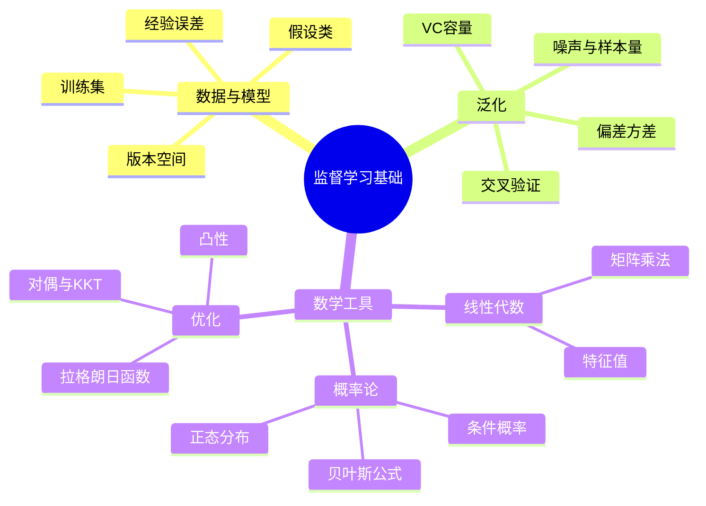

# CS182 第 2 周周二：监督学习的泛化与数学预备

课堂录屏：2026-09-22。图片是屏幕视频中的课件状态；同一页面的重复回看只收入一次。前半节为监督学习理论，后半节开始复习后续推导所需的线代、概率和优化。

## 本节主线

分类器不能只在训练样本上做对，还要在未来样本上有效。老师从训练集、假设类、经验误差和版本空间解释“从有限样本选模型”，再讨论维度、噪声、复杂度和样本量如何影响泛化。数学预备部分把矩阵、概率密度与贝叶斯公式、估计偏差/方差及约束优化串联起来。

## 逐页注释

### 监督学习与泛化

1. [从例子学习类别，08:40](page_005.jpg)：用家庭用车二分类区分正负样本；训练时知道样本标签，预测时要给未见车辆分类。
2. [训练集，09:36](page_006.jpg)：样本对 $(x_i,y_i)$ 中，$x_i$ 是属性向量，$y_i$ 是类别标签；样本数量 $N$ 有限。
3. [类别区域，12:40](page_007.jpg)：二维图中的矩形示意一个候选分类区域；边界不同就对应不同分类器。
4. [假设类，15:12](page_008.jpg)：学习算法在预先设定的假设集合 $\mathcal H$ 中选函数；表示能力不足会漏掉真实边界，过大又增加搜索和过拟合风险。
5. [经验误差，18:40](page_011.jpg)：在训练样本上统计预测错误比例。它能比较训练拟合，却不能直接替代未知数据分布上的真实误差。
6. [版本空间，22:24](page_012.jpg)：与全部训练样本一致的假设组成版本空间；有限数据可能容许多个彼此不同的候选模型。
7. [VC 维度，24:48](page_016.jpg)：用能否对一组点实现任意标记来刻画假设类容量。容量越大通常需要更多样本约束，不能只靠训练正确率判断泛化。
8. [噪声与复杂度，30:56](page_017.jpg)：标签噪声、模型复杂度和训练样本量一起影响学习结果；难题不是单纯把经验误差降到零。
9. [多类分类，37:12](page_018.jpg)：多类别任务要在多个类之间决定归属，可由二分类边界的思路推广，但输出空间更复杂。
10. [回归的经验误差，41:20](page_019.jpg)：连续值预测通常用平方误差等度量；仍须区分训练误差与总体预测误差。
11. [模型选择与泛化，46:24](page_021.jpg)：选择学习算法或超参数时，应看对未见样本的预测，而不是只看现有样本的拟合。
12. [偏差与方差权衡，52:48](page_022.jpg)：模型太简单偏差可能大；太灵活则对数据扰动敏感、方差可能大。两者的平衡依赖任务、样本量和噪声。
13. [交叉验证，62:56](page_025.jpg)：轮换训练集和验证集，估计模型在未见数据上的误差；特别适合数据有限时做模型选择。
14. [监督学习的维度，73:52](page_027.jpg)：课件从样本、假设、优化等维度归纳学习问题，提示理论分析要区分“可表示、可学到、能泛化”。

### 线性代数、概率与优化预备

15. [线性代数引入，78:00](page_029.jpg)：后续模型会频繁把样本、权重和线性变换写成向量/矩阵形式。
16. [矩阵是什么，79:36](page_030.jpg)：矩阵的行列索引与形状决定乘法是否有定义；检查维度是避免推导错误的第一步。
17. [矩阵运算，79:52](page_031.jpg)：加法要求形状相同；矩阵乘法按行与列相乘求和，一般不满足交换律。
18. [向量与指数，80:08](page_032.jpg)：向量范数衡量长度，指数/幂的书写需区分逐元素操作与矩阵运算。
19. [特征值与特征向量，80:40](page_033.jpg)：若 $Av=\lambda v$，$v$ 的方向在线性变换下不变；这是降维和矩阵分析常见工具。
20. [高斯向量，80:56](page_034.jpg)：多维正态分布由均值向量和协方差矩阵刻画；协方差描述维度间的联动。
21. [随机矩阵，81:20](page_035.jpg)：矩阵也可作为随机变量集合；课件用它衔接概率建模所需记号。
22. [事件与概率，82:00](page_036.jpg)：事件是样本空间的子集，交并补运算对应概率计算。
23. [条件概率，82:16](page_037.jpg)：$P(A\mid B)=P(A\cap B)/P(B)$，前提是 $P(B)>0$；条件改变时分母也改变。
24. [贝叶斯公式，83:36](page_038.jpg)：利用先验和似然更新后验：$P(A\mid B)=P(B\mid A)P(A)/P(B)$，为下节贝叶斯决策铺垫。
25. [矩与期望，86:32](page_040.jpg)：期望描述平均位置，方差或二阶矩描述波动；估计量分析也依赖这些量。
26. [离散随机变量，87:44](page_042.jpg)：概率质量函数在各取值上的和为 1。
27. [连续随机变量，88:32](page_043.jpg)：密度不是单点概率；区间概率由密度积分求得。
28. [正态分布，90:00](page_044.jpg)：用均值和方差决定钟形曲线的位置与尺度，是生成模型常见假设。
29. [连续分布例子，91:52](page_045.jpg)：结合分布函数和密度的关系练习积分与归一化。
30. [多元连续分布，92:48](page_046.jpg)：多维联合密度需要在整个空间积分为 1；边缘化可消去未关注的变量。
31. [优化问题，98:16](page_049.jpg)：机器学习训练可写为最小化目标函数，可能同时带等式或不等式约束。
32. [拉格朗日函数，100:08](page_050.jpg)：把约束引入目标函数，形成拉格朗日函数；乘子衡量约束对最优值的影响。
33. [对偶函数，104:56](page_051.jpg)：对原变量取下确界构造对偶函数，其值为原问题提供下界。
34. [弱对偶，105:44](page_052.jpg)：对偶可行解的目标值不超过原问题最优值；不要把弱对偶误写成必然相等。
35. [KKT 条件，106:08](page_053.jpg)：在适当条件下，最优点需满足原/对偶可行、驻点与互补松弛等条件。
36. [凸优化，106:40](page_054.jpg)：凸目标与凸可行域使局部最优与全局最优的关系更可控；它是后续模型推导的重要背景。

## 复习笔记

训练集只提供有限证据。假设类决定可以表达什么，学习算法决定怎样从中选择；经验误差衡量已见数据上的表现，泛化误差描述未来数据。两者之间的差距受样本量、噪声和模型容量影响。模型选择需独立验证，而不是把训练集用到最后仍称为“测试”。

数学上，监督学习常把输入表示为向量、预测写成参数化函数，并通过最小化损失求参数。概率帮助表示不确定性与从证据更新信念；优化则给出求解受约束参数的方法。复习时分别检查变量的维度、分布的归一化和优化条件的前提。

## 思维导图

## 核对提示

约 78 分钟后屏幕切到数学预备课件的编辑窗口，因此本节后半段图像中有 PowerPoint 工具栏；PDF 保留了实际录屏画面，不声称是原始 PPT 导出。口头转写中英文术语误识别较多，上述数学陈述按页面及上下文整理。
