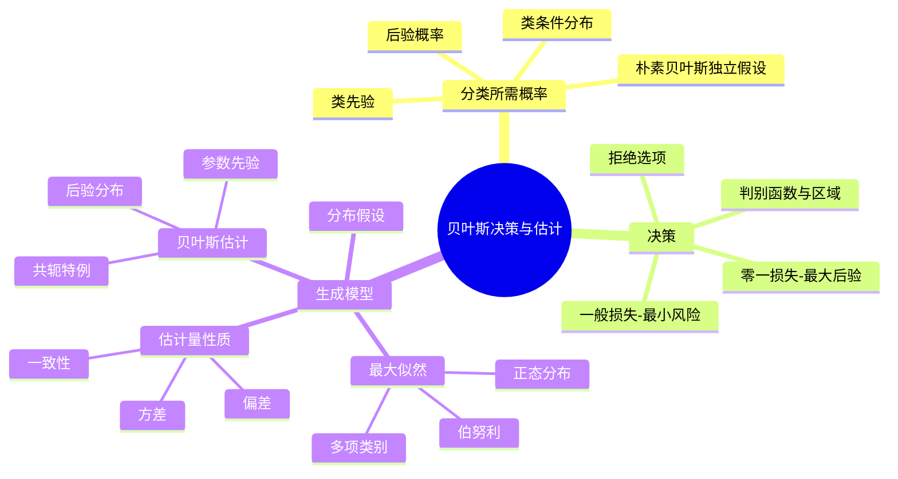

# CS182 第 2 周周四：贝叶斯决策与生成模型参数估计

课堂录屏：2026-09-24。页面取自屏幕录播，同一课件页的往返和编辑窗口状态已合并。图中公式以课件为准，中文语音识别中的术语误字已校正。

## 本节主线

从先验概率和特征的类条件分布推得后验概率，再根据损失函数选择动作。零一损失下是最大后验分类，但错误代价不同或允许“拒绝判断”时，最优决策会变化。后半节转向生成模型：在假定的概率分布族中，从样本估计参数，比较最大似然、估计量性质与贝叶斯估计。

## 逐页注释

### 贝叶斯分类与决策

1. [贝叶斯决策导入，06:08](page_003.jpg)：统计推断从随机样本推测未知的数据生成规律；分类只是利用推断结果作决策的一种任务。
2. [从数据推断，11:44](page_004.jpg)：需要区分真实数据分布、观测样本和从样本得到的估计。样本频率不保证与真概率完全相同。
3. [抛硬币例子，14:00](page_005.jpg)：用伯努利变量表示正反面，若只知两面概率，猜更可能的一面可使错误概率最小。
4. [参数估计与预测，15:12](page_006.jpg)：先从多次抛掷估计概率，再对下一次结果作预测；估计误差会传递到分类决策。
5. [信用评分，16:32](page_007.jpg)：实际分类有收入、储蓄等观测特征，目标是根据特征判断客户风险类别。
6. [二类贝叶斯分类 I，17:20](page_008.jpg)：$P(C_k)$ 是先验，$P(x\mid C_k)$ 是类条件分布；观测 $x$ 后，按贝叶斯公式得到 $P(C_k\mid x)$。
7. [二类贝叶斯分类 II，18:56](page_009.jpg)：在分类错误代价相同的前提下，选择后验概率较大的类别；不能把这一规则无条件用于不同代价场景。
8. [贝叶斯规则，20:40](page_010.jpg)：$P(C_k\mid x)=P(x\mid C_k)P(C_k)/P(x)$；比较类别时共同分母 $P(x)$ 可省略。
9. [多类规则，24:48](page_011.jpg)：类别互斥且穷尽时，选 $\arg\max_k P(C_k\mid x)$。多类情形仍需估计各类先验与类条件分布。
10. [朴素贝叶斯，27:44](page_012.jpg)：假定特征在给定类别下条件独立，把高维类条件分布分解为一维因子；它降低估计难度，但独立性是假设而非事实。
11. [损失与风险，31:12](page_015.jpg)：一个决策的风险是各真实类别损失的后验期望。最优决策应按风险最小，而不是只看类别概率。
12. [零一损失，35:28](page_016.jpg)：分类正确损失为 0、错误为 1 时，预测类别 $k$ 的条件风险为 $1-P(C_k\mid x)$，因此风险最小化等价于最大后验分类。
13. [拒绝选项，37:12](page_018.jpg)：低置信度时可选择不分类，付出固定拒绝代价 $\lambda$；比较其风险和各类别决策风险后再行动。
14. [判别函数 I，43:44](page_021.jpg)：把每类的后验或其等价单调变换写成判别函数，选得分最高的类别。
15. [判别函数 II，46:40](page_022.jpg)：比较类别时可用 $\log P(x\mid C_k)+\log P(C_k)$，乘积变加和更便于计算；共同项不影响排序。
16. [决策区域，52:48](page_025.jpg)：判别函数在特征空间中划出不同决策区域，相邻区域的等分边界就是分类边界。

### 生成模型与估计

17. [参数估计章节，67:04](page_034.jpg)：转入生成模型：先假设数据的概率形式，再估计其中未知参数；与直接学习分类边界的判别式方法侧重点不同。
18. [章节目录，71:12](page_035.jpg)：这一部分安排最大似然、估计性质、贝叶斯估计和不同分布例子。
19. [监督学习的几种路径，76:56](page_039.jpg)：参数化方法指定有限维分布族；非参数方法不预设同样固定的函数形式；半参数方法结合两者特征。
20. [参数化分类，84:56](page_041.jpg)：为各类估计 $P(x\mid C_k)$ 及先验，再用贝叶斯规则分类。模型好坏依赖分布假设是否适合数据。
21. [最大似然估计，88:00](page_042.jpg)：令 $\hat\theta_{ML}=\arg\max_\theta p(D\mid\theta)$；独立同分布样本的联合似然是各样本概率的乘积，常取对数化为求和。
22. [伯努利例子 I，90:48](page_043.jpg)：用正反面观测的次数构造似然，估计硬币出现正面的概率。
23. [伯努利例子 II，91:36](page_044.jpg)：最大似然解为正面次数除以总次数，即样本频率；样本很少时估计可能不稳定。
24. [广义伯努利 I，93:20](page_045.jpg)：多项类别参数必须非负且概率之和为 1，估计时需同时满足约束。
25. [广义伯努利 II，94:16](page_046.jpg)：用拉格朗日乘子求极值，得到每类的最大似然概率为该类样本频率。
26. [正态分布例子，96:32](page_049.jpg)：高斯模型需要估计均值和方差；分布假设将连续数据的学习化为少数参数的估计。
27. [估计量的偏差与方差，97:28](page_050.jpg)：估计量随抽样变化，是随机变量；偏差描述期望估计与真值的距离，方差描述不同样本下估计的波动。
28. [均方误差，100:08](page_051.jpg)：MSE 同时反映估计波动与系统偏差；“无偏”不自动保证单次估计最准确。
29. [无偏与一致，101:20](page_052.jpg)：无偏要求估计量期望等于真参数；一致性关注样本量增大时估计是否趋向真值，两者不是同一性质。
30. [贝叶斯估计，103:28](page_055.jpg)：在似然之外给参数设置先验，用贝叶斯公式得到参数的后验分布；结果可以是概率分布，不必只给一个点估计。
31. [计算问题，108:16](page_056.jpg)：后验分布常需积分归一化，计算可能比最大似然困难；共轭先验是某些模型的便利特例。
32. [共轭例子，109:04](page_057.jpg)：课件以可解析配对的先验与似然示例说明后验更新；不要据此误以为任意模型都能写出封闭解。

## 复习笔记

贝叶斯分类的第一步是用数据建模：先验 $P(C_k)$ 与类条件分布 $P(x\mid C_k)$ 共同决定后验。第二步才是决策：若所有错分成本一样，最大后验规则即可；若成本不同，就为每个动作计算条件风险 $R(a\mid x)=\sum_k L(a,C_k)P(C_k\mid x)$，选风险最小者。拒绝分类是一个额外动作，适合错误代价高、模型信心不足的情形。

生成模型的参数估计要先提出分布假设。最大似然只利用样本的似然，贝叶斯估计还引入参数先验并形成后验；两者回答的问题和输出形式不完全相同。估计量的偏差、方差、均方误差和一致性衡量不同方面，不能用其中一个指标概括全部质量。

## 思维导图

## 核对提示

课件在约 57 分钟后多次切换编辑窗口和章节封面；PDF 只保留不同内容页。式子中的先验、似然和后验不能互换，语音转写里“最大自然”等误词统一为“最大似然”。
