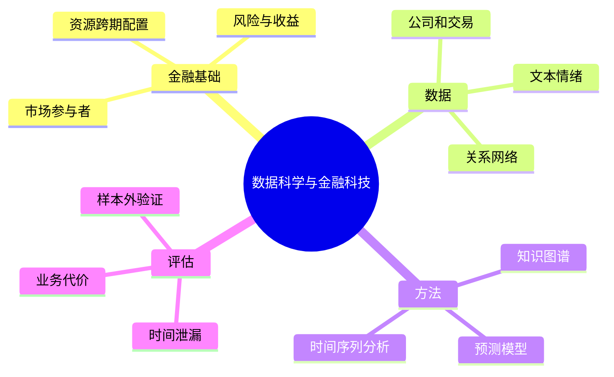

# CS277 第 1 周周二：数据科学与金融科技导论

本节通过金融风控和市场风险案例介绍课程目标，再建立金融系统的基本概念。页面为屏幕录播中筛出的代表性课件页；案例中的研究结果是课堂讨论材料，不应当作投资建议。

## 逐页注释

1. [课程封面，02:48](page_002.jpg)：课程聚焦数据科学方法在金融科技中的应用。
2. [教师背景，09:20](page_003.jpg)：课堂先介绍研究经历与案例来源，随后用实际项目说明数据如何进入金融决策。
3. [银行间市场案例，22:24](page_006.jpg)：借助知识图谱表示市场主体和关系，风险可能沿关联网络传递；图谱只是组织信息，预测仍须验证。
4. [图谱与风险节点，26:08](page_010.jpg)：节点、边和群落帮助识别关联，需警惕“关联密集”被直接解释为因果传播。
5. [文本情绪与市场，26:56](page_013.jpg)：从新闻或社交文本构造情绪指标，再与市场波动比较；文本采集时间、滞后窗口和样本外验证很关键。
6. [情绪时间序列，28:24](page_014.jpg)：事件或文本热度曲线显示阶段性峰值，但峰值与价格同现不等于预测能力。
7. [风险投资公司预测，34:08](page_021.jpg)：案例把公司状态、融资与关系网络等特征用于预测未来融资或成功概率。
8. [投资关系网络，37:36](page_025.jpg)：公司、投资人、行业等可构成异质图；训练与评估要避免把未来关系泄漏到过去的预测中。
9. [课程内容，41:44](page_029.jpg)：课程路线包括基础金融概念、数据来源、金融网络、风险管理及实际案例。
10. [课程目标，42:32](page_030.jpg)：既要懂金融问题的定义，也要懂数据处理与模型检验，不能只从算法出发。
11. [考核方式，48:08](page_033.jpg)：演讲、项目和课堂参与等要求以平台公告为准，特别留意组队与交付格式。
12. [金融基础，53:20](page_036.jpg)：金融的核心是跨时间配置资源并处理风险；不同金融工具分配收益与风险的方式不同。
13. [从例子理解金融，58:48](page_041.jpg)：借款、股权融资和创业投资对应不同的现金流、控制权和偿付义务。
14. [金融风险，64:32](page_044.jpg)：风险是未来结果的不确定性；应区分损失概率、损失幅度与承担风险的主体。
15. [市场参与者，67:52](page_049.jpg)：监管者、金融服务机构、投资者和企业在市场中的目标和信息并不相同。
16. [中国金融体系，71:28](page_054.jpg)：银行、资本市场和监管机构之间的关系构成后续数据场景的背景。

## 整节笔记

金融科技的建模通常从业务问题开始：预测什么、何时作决策、可用哪些当时已知的信息、错误的代价由谁承担。网络关系、文本情绪和公司数据分别提供结构、叙事和个体信息，但都可能含有选择偏差、时间泄漏和解释上的不确定性。

课堂案例说明数据科学能支持风险识别与资源配置，不代表模型可以独立替代制度、监管和专业判断。学习本课时应把“数据来源—特征—目标—评估—部署后果”连成闭环。

## 思维导图

