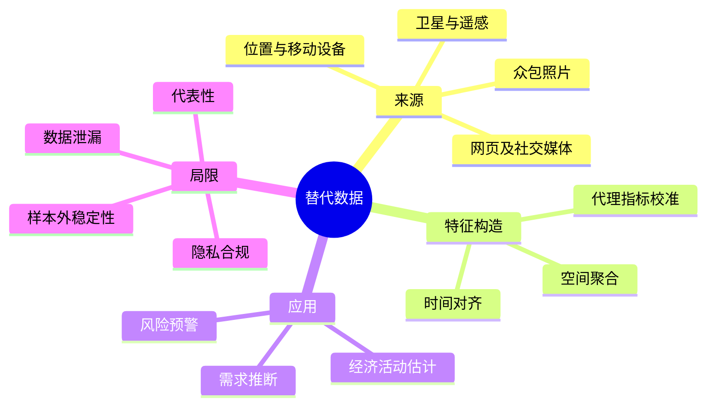

# CS277 第 1 周周四：替代数据及其金融应用

本节用从霍乱地图到卫星、位置、社交媒体和移动设备数据的案例，讨论“替代数据”如何辅助金融与经济活动推断。筛页保留不同案例的关键图示，重复动画状态未收入。

## 逐页注释

1. [主题封面，05:20](page_002.jpg)：替代数据指传统财务报表、交易价格之外可用于描述经济活动的数据。
2. [数据挖掘缘起，07:04](page_003.jpg)：课程先问“什么数据、为什么用、怎样用”，不是预设新数据一定更好。
3. [霍乱地图，13:52](page_006.jpg)：空间位置与病例分布结合，可发现传统表格难以直观看到的局部模式；地图关联仍需结合机制解释。
4. [数据发现的思路，18:00](page_011.jpg)：从观测、模式识别到可检验假设，再到业务决策，不能跳过验证步骤。
5. [社交与网页数据，36:08](page_018.jpg)：网络活动、搜索与社交平台留下行为痕迹，但代表性、机器人流量和平台规则会改变样本。
6. [卫星数据，38:56](page_020.jpg)：遥感提供地理覆盖和周期观测，可估计建设、农业或城市活动；云层、分辨率与重访周期限制解释。
7. [停车场/位置流量，43:52](page_023.jpg)：人流和车流可作为需求代理变量，必须区分“代理指标”与真正的销售额。
8. [生物多样性案例，47:12](page_026.jpg)：众包照片和遥感结合可扩展观测范围，质量控制与采样偏差成为关键。
9. [时间与地理属性，54:16](page_031.jpg)：替代数据往往同时具有时间戳和空间位置；对齐时间窗口和地理边界是建模前提。
10. [雪覆盖估计，57:28](page_035.jpg)：用图像及曲线估计雪深/覆盖，说明从原始数据到可用特征要经过校准。
11. [移动用户行为，75:20](page_046.jpg)：手机传感、位置和使用记录可刻画群体行为；隐私保护与聚合粒度必须前置考虑。
12. [每日活动模式，76:40](page_048.jpg)：周期模式可从位置序列推断，但个体数据并不自动代表总体。
13. [社交媒体与消费者行为，81:12](page_050.jpg)：情绪、话题和传播关系可以作为消费者信号，需防止事件热度与实际行为混淆。
14. [时间序列提取，82:32](page_053.jpg)：把不规则事件整理成可比较的时序特征，要处理缺失、时区与观测频率。
15. [相关性实验，87:52](page_058.jpg)：看见相关不等于有可交易或可部署的预测增益；需样本外、时间顺序严格的评估。
16. [矿区/卫星指标，94:48](page_069.jpg)：遥感量化工业活动可作为经济指标的替代观测，仍需地面真值校验。
17. [灾害与市场，101:44](page_073.jpg)：自然灾害数据用于分析供应、风险及价格反应，分析时应区分事件发生与市场知晓时间。

## 整节笔记

替代数据的价值在于比传统披露更频繁、更细粒度或覆盖不同维度，但它通常测的是代理变量。正确流程是：定义金融问题，确认信号在决策前可获得，清洗并校准数据，把样本与标签按时间/空间对齐，再与简单基线比较样本外表现。

主要风险包括采样偏差、平台机制变化、代理指标失效、数据泄漏、隐私和合规。课堂的历史与跨领域案例强调“发现可用信息”的方法论，而不是说每张图都能直接产生投资回报。

## 思维导图

