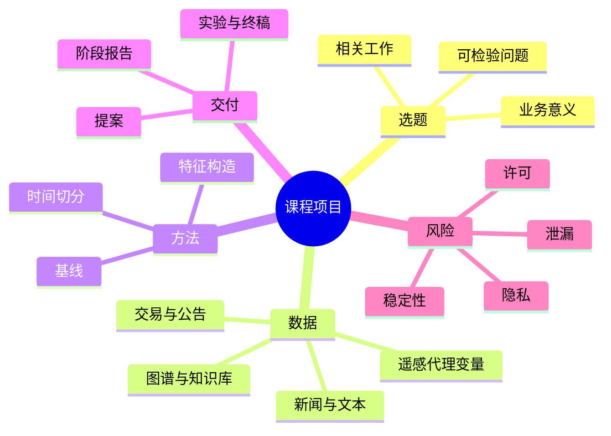

# CS277 第 2 周周二：课程项目与可用数据资源

本节前半段解释课程项目如何选题、评估和写报告；后半段用案例提示研究方向，并展示可用公开数据。截图只保留内容页；具体评分与提交要求请以课程最新通知为准。

## 逐页注释

1. [课程项目，04:32](page_002.jpg)：项目需要明确数据科学方法所解决的金融或经济问题。
2. [项目要求，10:00](page_003.jpg)：题目、数据、方法、实验与结论应相互对应；避免只堆技术名词。
3. [项目评估，17:52](page_005.jpg)：成绩评价关注问题定义、方法可靠性、实验质量和呈现；以课堂/平台公告核对细则。
4. [提案，22:08](page_006.jpg)：说明研究问题、背景、数据来源、可行方法和计划中的评估方式。
5. [摘要，32:16](page_007.jpg)：摘要应压缩呈现问题、方法与结果，不是引言或相关工作的重复。
6. [相关工作，38:00](page_009.jpg)：比较已有研究的任务、数据与限制，从差距中定位项目贡献。
7. [问题陈述，43:04](page_010.jpg)：把宽泛兴趣收敛成可检验问题，明确预测对象、时间尺度及可用信息。
8. [实验方法，44:00](page_011.jpg)：给出数据划分、基线、评价指标与复现实验的步骤；金融时序数据尤其不能随机打乱后泄漏未来。
9. [阶段报告与终稿，47:52](page_013.jpg)：阶段性成果需要暴露风险与进展；终稿应解释负结果、误差与方法局限。
10. [SSE 数据，52:16](page_015.jpg)：交易所和官方平台提供较规范的公开数据；要检查许可、更新频率和字段含义。
11. [投资/市场案例，54:00](page_017.jpg)：课堂列举风险、企业与文本分析案例，帮助把“技术”转化成具体研究问题。
12. [投资图谱，59:36](page_023.jpg)：网络结构可表示公司、融资和投资人的关系，预测时需要冻结到决策时点的数据。
13. [名人行迹研究，61:04](page_027.jpg)：非传统数据可支持行为分析，也可能造成隐私及样本偏差问题。
14. [课程数据入口，64:00](page_032.jpg)：先阅读数据说明、许可和时间覆盖，再决定是否适合项目。
15. [APS / NBA / IMDb，65:12](page_034.jpg)：论文、体育与影视等跨域数据适合练习网络、预测或文本方法，但金融关联需有明确论证。
16. [维基百科与知识数据，69:20](page_039.jpg)：实体链接和公开知识库可补充结构信息，需注意编辑时间和事实更新时间。
17. [新闻数据，73:20](page_042.jpg)：新闻适合事件或情绪特征，但发布时间、抓取时间和市场反应窗口必须对齐。
18. [公司公告与市场数据，78:24](page_050.jpg)：公告属于事件源，行情是结果或控制变量；不能把结果窗口内数据混入输入。
19. [夜间灯光与社会经济数据，80:00](page_053.jpg)：遥感代理变量能补充传统统计，但需与地理单元、年度口径和地面真值校准。

## 整节笔记

一个可做的项目应先写清：研究问题是什么，谁会使用结果，预测时点能看到哪些数据，怎样设置强但公平的基线，以及什么结果会推翻自己的假设。方法复杂度应服务于问题，不应成为项目的唯一贡献。

数据清单不是“拿来就能训练”的素材仓库。公开数据有许可、缺失、更新滞后、实体对齐和时间泄漏问题。特别是金融预测，应按时间前后做训练/验证/测试，报告交易成本或决策代价，而不是只报随机划分的准确率。

## 思维导图

