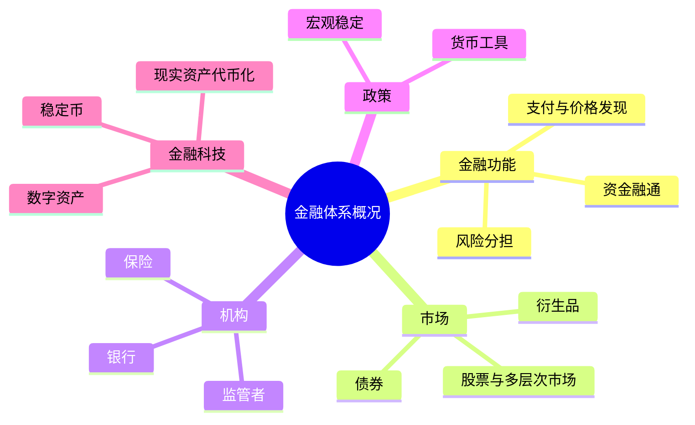

# CS277 第 2 周周四：当前金融体系概况

这节课录屏呈现的是一份金融体系概况专题课件，页数少但单页讲解时间较长。课件包含截至 2026 年的数字、政策和机构比较；下面只归纳结构性概念，不将这些数值视作今日实时数据或投资建议。

## 逐页注释

1. [专题封面，10:00](page_003.jpg)：讲解中国金融体系的结构与当前讨论热点。
2. [目录，12:24](page_004.jpg)：从金融存在的理由，依次进入市场、机构、科技及稳定性问题。
3. [金融为什么存在，12:40](page_005.jpg)：金融的作用是跨时间、跨主体配置资金，并帮助分担和管理不确定性。
4. [三个核心理由，14:08](page_006.jpg)：课件强调资金供需匹配、风险管理和价值/流动性传递；具体制度是这些功能的不同实现。
5. [舆论与现实，16:48](page_007.jpg)：面对金融争议，应区分金融功能、某种产品设计和个别机构行为。
6. [监管框架变化，29:52](page_008.jpg)：组织结构可能随政策调整；学习时更重要的是理解监管对象和职责分配。
7. [监管主体，40:32](page_009.jpg)：不同机构负责货币、银行、证券、保险等不同环节，监管交叉也带来协调问题。
8. [多层次资本市场，45:20](page_011.jpg)：市场层级服务不同规模、成熟度和融资需求的主体；挂牌与上市条件并不相同。
9. [投资者结构，48:16](page_012.jpg)：个人和机构投资者在资金规模、期限、风险承受及信息处理上有差别。
10. [债券市场，63:04](page_014.jpg)：债券融资通过票息、期限和违约风险配置资金；不能只看发行规模。
11. [券种与交易场所，64:32](page_015.jpg)：债券类型及场所差异影响流动性、参与者和监管口径。
12. [金融衍生品，72:08](page_016.jpg)：衍生工具可用于套期保值，也可转移或放大风险；风险管理取决于敞口和使用方式。
13. [银行业，74:40](page_017.jpg)：商业银行等机构在信贷、支付和资金中介中有核心地位。
14. [银行业务，75:44](page_018.jpg)：表内业务与表外业务的风险表现及资本约束不同，不能只看名义规模。
15. [保险业，77:36](page_019.jpg)：保险通过风险池与精算定价分担损失，偿付能力与负债期限是关键。
16. [货币政策工具，79:44](page_020.jpg)：数量、价格和结构性工具作用渠道不同，政策变化影响实体融资与市场预期。
17. [金融科技，82:24](page_022.jpg)：数据与自动化可改善效率，也带来模型风险、隐私与监管挑战。
18. [稳定币，82:56](page_023.jpg)：讨论数字资产稳定机制时，要分清储备资产、赎回承诺、发行人和监管约束。
19. [稳定币监管，84:08](page_024.jpg)：跨地区规则与市场结构不同，不能把某一司法辖区的要求概括成普遍规则。
20. [USDC 与 USDT，85:28](page_025.jpg)：同为美元挂钩代币，透明度、储备结构与发行机制需分别考察。
21. [现实世界资产代币化，86:40](page_026.jpg)：链上表示不能自动解决底层资产确权、托管、合规和流动性问题。

## 整节笔记

理解金融体系，先从功能出发：资金中介、风险分担、支付清算和价格发现，再看银行、资本市场、保险与衍生品如何分别承担这些功能。监管的对象既是机构，也是活动和风险；制度名称会变，分析框架应可迁移。

金融科技部分不能只讨论“上链”或模型性能。稳定币的可信度取决于储备与赎回机制，资产代币化仍依赖法律权利和托管安排。课件中的日期性统计和政策陈述请回到原始发布机构核对，不能直接用于当下决策。

## 思维导图

