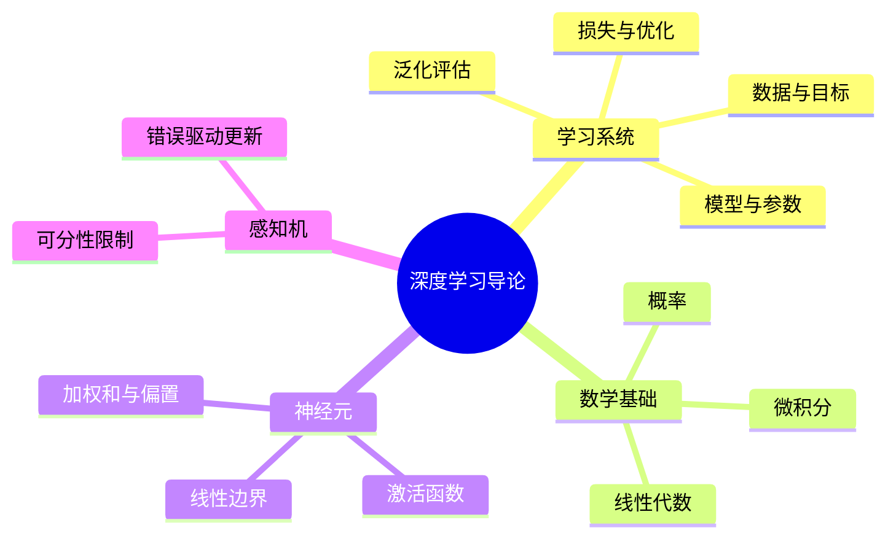

# CS280 第 1 周周一：深度学习导论与单层感知机

本节前半段讲课程安排与深度学习的动机，后半段从数学基础、监督学习和泛化过渡到人工神经元与感知机。图片是录屏截图；网页演示和重复动画状态未收入最终页集。

## 逐页注释

1. [课程封面，06:08](page_002.jpg)：深度学习课程从网络结构、训练与实际应用展开。
2. [课程路线，06:32](page_003.jpg)：从基础神经网络和优化，逐步进入更复杂的网络结构与应用。
3. [课程目标，07:04](page_004.jpg)：需要理解模型工作原理、训练方法和适用范围，而不只是调用现成框架。
4. [课程安排，09:44](page_005.jpg)：考核、预备知识与练习安排以最新课程平台公告为准。
5. [先修知识，26:48](page_017.jpg)：微积分、线性代数、概率和编程共同支撑梯度推导与网络实现。
6. [数据驱动方法，32:16](page_022.jpg)：让模型从样本估计规律，需要定义输入、输出和可检验的学习目标。
7. [为何深度学习，39:04](page_025.jpg)：深层表示有利于从原始数据中逐层构造有用特征，但数据量、计算和训练条件也随之增加。
8. [深度学习历史，42:48](page_029.jpg)：神经网络的发展并非单线进步，算法、数据和硬件条件共同影响不同阶段的成果。
9. [模型、数据与 AI，55:44](page_041.jpg)：模型结构提供归纳偏置，数据约束参数，任务评估决定是否真的有效。
10. [数学基础：微积分，74:56](page_049.jpg)：导数与梯度描述目标函数变化方向，是优化参数的核心工具。
11. [概率，76:04](page_051.jpg)：不确定性与概率分布用于表达预测、噪声和数据生成假设。
12. [最优化，81:12](page_061.jpg)：损失函数定义“错多少”，优化器迭代更新参数，二者不能混为一谈。
13. [泛化，84:00](page_064.jpg)：训练误差低不代表测试误差低；模型复杂度、正则化和数据分布共同影响泛化。
14. [监督学习，85:44](page_067.jpg)：训练集由输入与目标输出配对；模型学习映射后需在未见样本上验证。
15. [人工神经元，86:32](page_068.jpg)：一个单元计算加权和与偏置，再经激活函数输出；权重是训练得到的参数。
16. [激活函数，87:12](page_069.jpg)：非线性激活让多个层的组合不退化成单个线性变换。
17. [单神经元的容量，90:00](page_072.jpg)：单层线性分类器只能形成线性决策边界，不能表示所有类别形状。
18. [感知机算法，93:20](page_076.jpg)：错误分类时调整权重以改善边界；可分性和学习率影响收敛行为。
19. [感知机更新，96:08](page_080.jpg)：样本驱动的逐步更新与损失/梯度思想相连，但对不可线性分的问题不能保证找到零错误边界。

## 整节笔记

深度学习仍遵循机器学习的基本结构：数据、参数化模型、损失函数、优化算法与泛化评估。神经元把特征加权求和并加入非线性激活；单个线性神经元的分类边界有限，组合成多层网络才能表达更复杂的关系。

感知机是理解“从错误中更新权重”的简洁例子，但它不是现代深层网络训练的完整方案。复习时应分清表示能力、如何训练、是否收敛以及是否能推广到新数据这四个问题。

## 思维导图

