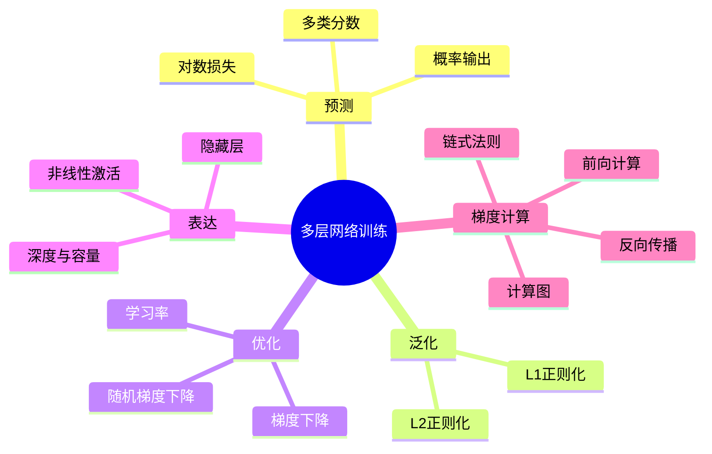

# CS280 第 1 周周三：多层神经网络与反向传播

本节先把单神经元扩展为多分类输出，再介绍损失、正则化和梯度下降；后半段讨论多层网络的表达能力，并推导反向传播。图片是录屏中筛出的关键页面。

## 逐页注释

1. [神经元数学模型，06:24](page_002.jpg)：$z=w^Tx+b$ 后接激活函数，权重和偏置由训练决定。
2. [单神经元分类，07:04](page_003.jpg)：线性边界把特征空间分为两侧；可分性限制仍然存在。
3. [多输出网络，08:00](page_004.jpg)：多个输出单元可给不同类别产生分数，后续再转化为预测。
4. [概率视角，11:52](page_008.jpg)：输出需要合理归一化才能解释为类别概率；分数和概率不是同一对象。
5. [多类线性分类器，13:28](page_009.jpg)：每一类有一组权重，多类决策可看成比较各类别得分。
6. [对数回归损失，18:40](page_013.jpg)：根据正确类别的预测概率构造损失；高置信度错判会受到较大惩罚。
7. [正则化，24:32](page_017.jpg)：在经验损失之外惩罚复杂参数，防止仅追随训练样本的细节。
8. [L1 与 L2，29:20](page_021.jpg)：两种惩罚对参数形态影响不同；L1 常促稀疏，L2 倾向收缩但不必归零。
9. [梯度下降，34:32](page_023.jpg)：沿损失函数的负梯度方向更新参数，学习率控制每次步长。
10. [随机梯度下降，36:24](page_024.jpg)：用样本或小批量近似全量梯度，单次更新便宜但含随机噪声。
11. [多层感知机，64:00](page_038.jpg)：隐藏层与非线性激活组合，使网络能表达单个线性单元无法表示的区域。
12. [网络容量，72:00](page_044.jpg)：层数和宽度影响表示能力，但更大网络也带来训练与泛化问题。
13. [为何更深，74:00](page_046.jpg)：深层结构可复用中间特征，某些函数的表达更紧凑；并不是所有任务都必然需要更深网络。
14. [前向计算，78:48](page_050.jpg)：从输入逐层计算激活并得到损失，保存中间值以便之后求梯度。
15. [反向传播，81:20](page_053.jpg)：从损失对输出的导数开始，逆着计算图应用链式法则求各层参数梯度。
16. [计算图，91:04](page_062.jpg)：把复合函数拆成局部操作，每条边传递相应的导数，避免重复计算。
17. [链式法则，92:40](page_064.jpg)：上游梯度乘本地导数得到下游梯度；有分叉时汇总来自不同路径的贡献。
18. [通用反向传播，94:16](page_065.jpg)：先前向记录节点值，再反向累积导数，是自动微分系统的核心模式。
19. [课程小结，101:52](page_070.jpg)：回顾网络结构、损失、优化与梯度计算的分工。

## 整节笔记

多类分类先产生每类分数，再通过合适的概率化与损失函数学习权重。正则化约束模型复杂度，梯度下降和 SGD 解决参数如何更新；它们各自回答不同问题。深层网络通过层间组合提升表达能力，但参数更多，必须关注训练稳定性与泛化。

反向传播不是新的学习目标，而是高效计算梯度的方法。关键等式是链式法则：若 $L$ 依赖 $y$、$y$ 依赖 $x$，则 $\partial L/\partial x=(\partial L/\partial y)(\partial y/\partial x)$。计算图有多条路径时，梯度贡献求和；因此反向传播能在一次反向遍历中求出大量参数梯度。

## 思维导图

