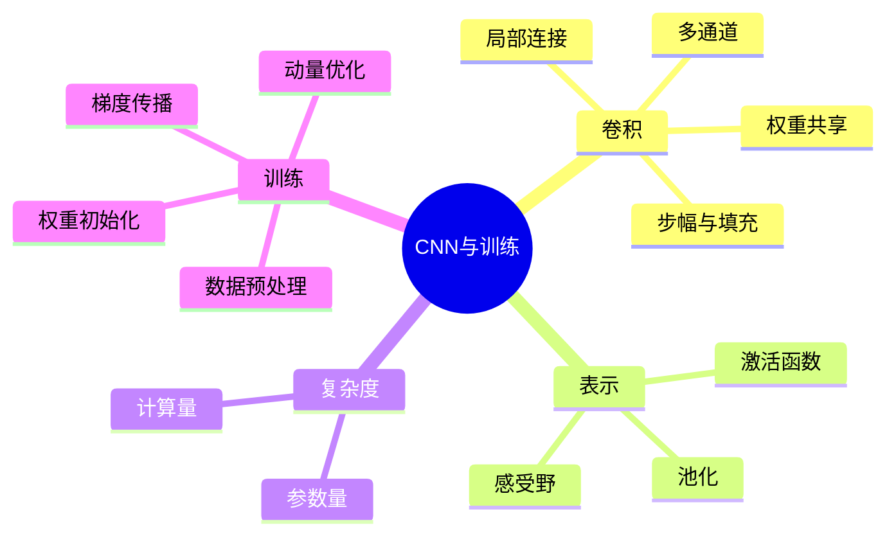

# CS280 第 2 周周一：卷积网络、初始化与优化

本节先用图像说明卷积网络的局部连接与权重共享，接着讨论激活、池化、参数量和网络训练；后半段进入数据预处理、权重初始化以及优化问题。所选页面是不同知识点的代表页，动画重复状态已合并。

## 逐页注释

1. [卷积网络章节，00:16](page_001.jpg)：CNN 是面向网格状数据的网络结构，图像是最常见例子。
2. [卷积的动机，06:16](page_002.jpg)：全连接层忽略空间邻近关系且参数多，局部卷积利用图像的空间结构。
3. [CNN 总览，09:52](page_004.jpg)：卷积层、非线性与池化逐层构造特征，最后接任务输出。
4. [二维卷积，16:00](page_010.jpg)：卷积核在图像上滑动，对局部窗口作加权求和；输出尺寸取决于核大小、步幅和填充。
5. [一维卷积，18:56](page_011.jpg)：卷积思想不限于二维图像，也可用于序列或时间信号。
6. [卷积层，20:00](page_012.jpg)：一个滤波器在不同位置复用同一组参数，形成特征图；这就是权重共享。
7. [多个滤波器，23:36](page_015.jpg)：不同卷积核学习不同响应，输出通道数由滤波器个数决定。
8. [特殊卷积，26:40](page_019.jpg)：步幅、填充或核形状改变感受野与输出尺寸，需逐层核对张量形状。
9. [卷积复杂度，29:20](page_020.jpg)：参数量与核尺寸、输入/输出通道相关，不随图像每个位置各自增加；计算量仍受空间尺寸影响。
10. [感受野，33:44](page_025.jpg)：深层单元可受更大输入区域影响；层数、核、步幅与池化共同决定有效范围。
11. [ReLU，43:20](page_030.jpg)：$\max(0,x)$ 计算简单、正区间梯度不饱和，但负区间可能长期零梯度。
12. [Leaky ReLU，46:16](page_034.jpg)：为负区间保留小斜率，缓解纯 ReLU 的“死亡”单元问题。
13. [池化，48:40](page_038.jpg)：聚合局部区域以降低空间分辨率和计算成本，也会丢失部分精细位置信息。
14. [卷积的数学性质，61:36](page_042.jpg)：局部连接与平移等变性解释了 CNN 的归纳偏置；池化可增强一定程度的位置鲁棒性。
15. [训练概览，70:40](page_049.jpg)：需要同时考虑数据预处理、初始化、优化与泛化，不是只设计层结构。
16. [数据预处理，74:48](page_052.jpg)：尺度和分布不一致会使优化困难；中心化、归一化等操作必须只按训练集统计量拟合。
17. [权重初始化，80:24](page_059.jpg)：初始化过大或过小会使信号和梯度在层间放大/消失。
18. [初始化分布，84:08](page_062.jpg)：依据输入或输出连接数量设置方差，使传播中的激活尺度相对稳定。
19. [优化景观，92:40](page_069.jpg)：非凸损失面存在鞍点、平坦区域和复杂曲率；只凭二维示意不能判断实际训练结果。
20. [动量方法，99:20](page_079.jpg)：利用过去梯度方向累积更新，可降低狭长谷地中的震荡；仍需调整学习率等超参数。

## 整节笔记

CNN 的关键归纳偏置是局部连接和权重共享。对于输入高 $H$、宽 $W$、通道 $C_{in}$，使用 $K\times K$ 卷积核产生 $C_{out}$ 个输出通道时，主要权重数为 $K^2C_{in}C_{out}$，另可有偏置；输出空间尺寸则由填充和步幅决定。不要混淆参数量与乘加运算量。

激活函数提供非线性，池化做局部汇聚，深层堆叠扩大感受野。训练时数据尺度、初始化和优化器共同影响梯度传播；看到训练困难时应先检查张量形状、输入归一化、学习率与梯度大小，再换更复杂结构。

## 思维导图

