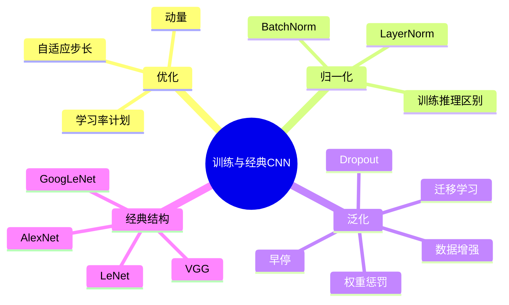

# CS280 第 2 周周三：优化、归一化、正则化与经典 CNN

本节先延续优化器讨论，再介绍批归一化、早停、数据增强、权重惩罚和 Dropout；最后浏览 LeNet、AlexNet、VGG、GoogLeNet 等 CNN 结构。图片为筛选后的课堂录屏页面。

## 逐页注释

1. [优化回顾，07:36](page_002.jpg)：参数更新受梯度和学习率影响，优化器的设计改变更新方向与尺度。
2. [动量，10:00](page_004.jpg)：通过速度项平滑历史梯度，可在方向一致时加速、在振荡方向减速。
3. [自适应学习率，16:32](page_011.jpg)：按参数坐标调整步幅，有助于处理不同尺度梯度；优化速度与泛化表现不能直接划等号。
4. [学习率策略，27:28](page_022.jpg)：学习率过高可能震荡，过低训练慢或停滞；衰减策略需结合验证曲线评估。
5. [批归一化，38:08](page_034.jpg)：用小批量统计量归一化中间激活，再用可学习缩放和平移恢复表达能力。
6. [训练与推理统计量，44:16](page_039.jpg)：训练时使用批统计，推理时使用累计统计；批量大小和分布变化会影响效果。
7. [层归一化，50:40](page_044.jpg)：归一化维度不同于 BatchNorm，适合其他结构或小批量场景。
8. [过拟合与早停，63:12](page_047.jpg)：验证误差开始恶化时停训，可视为一种正则化；不能在测试集上调停训轮数。
9. [数据增强，66:00](page_051.jpg)：通过不改变标签语义的变换增加有效训练样本；变换必须符合任务。
10. [参数惩罚，71:04](page_054.jpg)：权重衰减等方法抑制过大参数，需区分它与优化器更新规则的实现细节。
11. [迁移学习，76:08](page_059.jpg)：利用预训练表示减少目标任务对标注数据的需求；源域与目标域差异仍是风险。
12. [Dropout，81:44](page_065.jpg)：训练时随机屏蔽单元以减少协同适应；推理时使用完整网络及相应缩放。
13. [Dropout 与正则化，87:28](page_075.jpg)：随机失活可看成训练多个共享参数子网络的近似，不能代替数据质量和任务验证。
14. [卷积网络概览，90:40](page_078.jpg)：经典网络的发展反映更深结构、模块化与训练技巧的演进。
15. [LeNet，93:20](page_079.jpg)：早期用于手写字符的卷积网络，奠定卷积—池化—分类的基本范式。
16. [AlexNet，94:40](page_082.jpg)：借助大规模图像数据、GPU 与 ReLU 等训练技术推动深度 CNN 应用。
17. [VGG，95:36](page_084.jpg)：用小卷积核反复堆叠形成较深网络，结构规则但计算开销较大。
18. [GoogLeNet，100:16](page_089.jpg)：并行多尺度卷积分支体现模块化设计，关注计算效率与特征融合。

## 整节笔记

优化器解决“怎样根据梯度更新”，归一化改善中间表示的数值条件，正则化和数据增强帮助泛化，这些手段并不能彼此替代。BatchNorm 的统计维度与训练/推理行为必须分开理解；Dropout 也有训练时随机、推理时确定的两种模式。

经典 CNN 可按问题看：LeNet 建立基础结构，AlexNet 展示大规模数据和硬件带来的突破，VGG 用统一的小卷积核加深网络，GoogLeNet 通过模块化多分支处理尺度和计算问题。记住设计动机比只背层数更有用。

## 思维导图

